# 📊 Digital Corporativo — Data Analytics

<p align="center">
  
  
  
  
  
  
  
</p>

<p align="center">
  <strong>Pipeline de dados corporativos desenvolvido em Python</strong>
</p>

<p align="center">
  Transformando dados brutos em informações, indicadores e insights para apoiar decisões de negócio.
</p>

---

## 📌 Sumário

- [Sobre o Projeto](#-sobre-o-projeto)
- [Objetivos](#-objetivos)
- [Problema de Negócio](#-problema-de-negócio)
- [Arquitetura da Solução](#-arquitetura-da-solução)
- [Tecnologias](#-tecnologias)
- [Banco de Dados](#-banco-de-dados)
- [Estrutura dos Schemas](#-estrutura-dos-schemas)
- [Relacionamento dos Dados](#-relacionamento-dos-dados)
- [Pipeline de Dados](#-pipeline-de-dados)
- [Estrutura do Projeto](#-estrutura-do-projeto)
- [Descrição dos Arquivos](#-descrição-dos-arquivos)
- [Extração dos Dados](#-extração-dos-dados)
- [Transformação dos Dados](#-transformação-dos-dados)
- [Análise dos Dados](#-análise-dos-dados)
- [Indicadores](#-indicadores)
- [Análises de Negócio](#-análises-de-negócio)
- [Dashboard](#-dashboard)
- [Inteligência Artificial](#-inteligência-artificial)
- [Segurança](#-segurança)
- [Instalação](#-instalação)
- [Configuração](#-configuração)
- [Execução](#-execução)
- [Validação](#-validação)
- [Roadmap](#-roadmap)
- [Competências Demonstradas](#-competências-demonstradas)
- [Aprendizados](#-aprendizados)
- [Documentação](#-documentação)
- [Autor](#-autor)

---

# 📌 Sobre o Projeto

O **Digital Corporativo — Data Analytics** é um projeto de análise de dados desenvolvido em **Python**, integrado a um banco de dados **PostgreSQL**.

O projeto tem como finalidade demonstrar, de forma prática, a construção de um fluxo completo de análise de dados, desde a conexão e exploração do banco até a transformação dos dados, geração de indicadores, visualização e obtenção de insights.

A solução trabalha com diferentes áreas de uma organização:

| Área | Objetivo da análise |
|---|---|
| 💰 Financeiro | Analisar contas a pagar, contas a receber e situação dos títulos |
| 🛒 Vendas | Analisar faturamento, vendas e desempenho comercial |
| 👥 Clientes | Analisar perfil e comportamento dos clientes |
| 📦 Produtos | Analisar vendas, custos, categorias e desempenho |
| 👨‍💼 Vendedores | Analisar desempenho e ranking comercial |
| 🧑‍💼 RH | Relacionar funcionários, cargos e departamentos |

O projeto utiliza uma abordagem de **Data Analytics**, conectando dados técnicos a perguntas de negócio.

---

# 🎯 Objetivos

## Objetivo Geral

Construir uma solução de **Data Analytics em Python** capaz de extrair, tratar, analisar e visualizar dados corporativos provenientes de diferentes áreas da organização.

## Objetivos Específicos

- Conectar uma aplicação Python ao PostgreSQL.
- Explorar a estrutura do banco de dados.
- Identificar schemas e tabelas.
- Criar consultas SQL.
- Utilizar `JOINs` para integrar informações.
- Extrair dados relevantes para análise.
- Realizar tratamento e transformação utilizando Pandas.
- Criar métricas e indicadores.
- Analisar vendas, clientes, produtos, vendedores e financeiro.
- Desenvolver um dashboard interativo.
- Integrar uma camada de Inteligência Artificial para interpretação dos indicadores.
- Organizar o projeto utilizando boas práticas de desenvolvimento.
- Versionar o projeto utilizando Git e GitHub.

---

# 💼 Problema de Negócio

Uma organização possui informações distribuídas em diferentes áreas do banco de dados.

Os dados estão separados em estruturas como:

```text
Financeiro
Vendas
Clientes
Produtos
RH
```

O desafio é transformar essas informações em uma visão analítica integrada.

O processo pode ser representado da seguinte forma:

```text
DADOS BRUTOS
     ↓
EXTRAÇÃO
     ↓
INTEGRAÇÃO
     ↓
TRATAMENTO
     ↓
ANÁLISE
     ↓
INDICADORES
     ↓
VISUALIZAÇÃO
     ↓
INSIGHTS
     ↓
DECISÃO
```

Dessa forma, o projeto não se limita à criação de gráficos.

O objetivo é construir um processo capaz de responder perguntas relevantes para o negócio.

---

# 🏗️ Arquitetura da Solução

A arquitetura do projeto foi organizada em camadas.

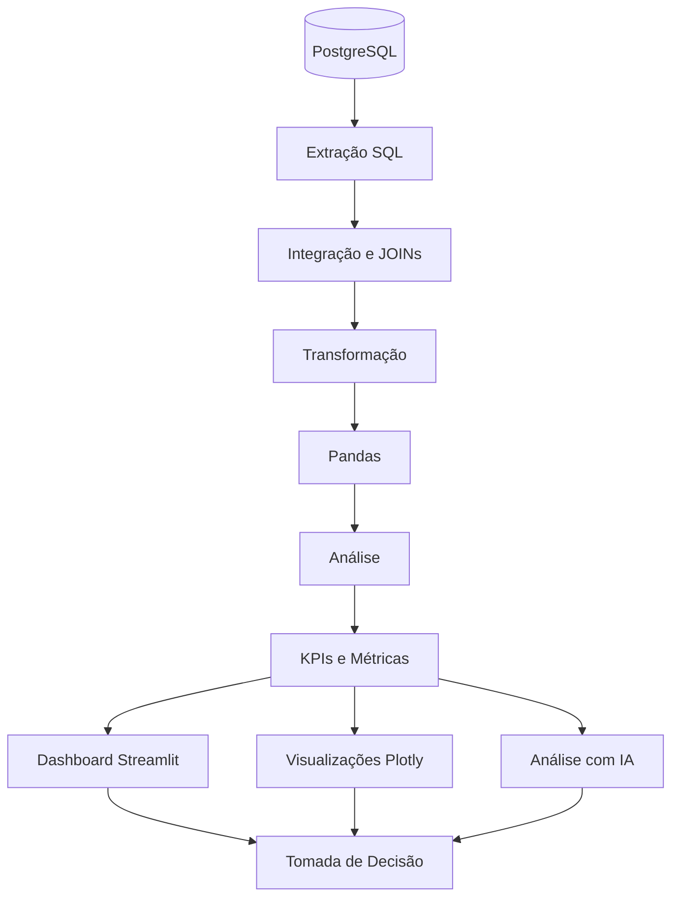

## Camadas

| Camada | Responsabilidade |
|---|---|
| 🗄️ Banco | Armazenamento dos dados |
| 🔎 Extração | Consultas SQL e obtenção dos dados |
| 🔗 Integração | JOINs entre tabelas |
| 🧹 Transformação | Limpeza e padronização |
| 📊 Análise | Métricas e indicadores |
| 📈 Visualização | Gráficos e dashboard |
| 🤖 IA | Interpretação e recomendações |

---

# 🛠️ Tecnologias

## Linguagem

- Python 3.x

## Banco de Dados

- PostgreSQL

## Manipulação de Dados

- Pandas
- NumPy

## Banco / Conexão

- SQLAlchemy
- psycopg2

## Visualização

- Plotly

## Dashboard

- Streamlit

## Configuração

- python-dotenv

## Inteligência Artificial

- API de IA

## Versionamento

- Git
- GitHub

---

# 🗄️ Banco de Dados

O banco utilizado pelo projeto possui diferentes schemas.

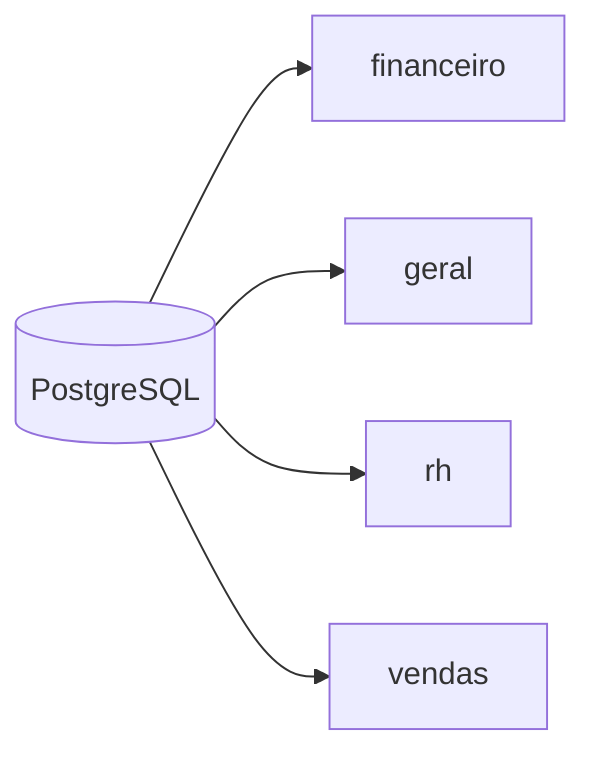

Os schemas identificados durante a exploração foram:

```text
financeiro
geral
rh
vendas
```

---

# 💰 Schema `financeiro`

O schema financeiro contém informações relacionadas ao controle financeiro.

### Tabelas

```text
financeiro
├── conta_pagar
├── conta_receber
└── situacao_titulo
```

## `conta_pagar`

Principais campos:

- `id`
- `documento`
- `emissao`
- `vencimento`
- `valor_original`
- `valor_atual`
- `id_situacao`
- `data_pagamento`
- `id_forma_pagamento`
- `descricao`

## `conta_receber`

Principais campos:

- `id`
- `id_parcela`
- `vencimento`
- `valor_original`
- `valor_atual`
- `id_situacao`
- `data_recebimento`
- `id_forma_pagamento`

## `situacao_titulo`

Tabela utilizada para representar a situação dos títulos financeiros.

---

# 👥 Schema `geral`

O schema `geral` concentra informações cadastrais e de localização.

### Tabelas

```text
geral
├── bairro
├── cidade
├── contato
├── endereco
├── estado
├── pessoa
├── pessoa_fisica
├── pessoa_juridica
├── responsavel_juridico
└── tipo_contato
```

### Estrutura conceitual

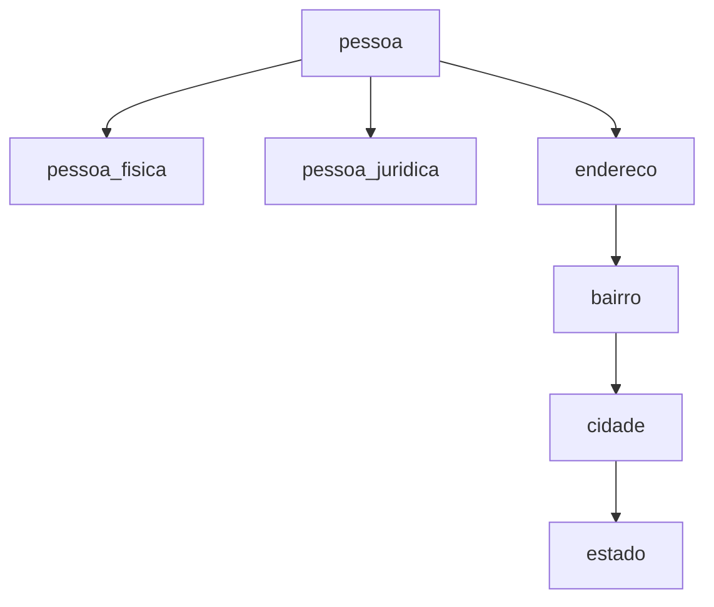

---

# 🧑‍💼 Schema `rh`

O schema `rh` contém informações relacionadas aos funcionários.

### Tabelas

```text
rh
├── cargo
├── departamento
├── escolaridade
├── funcionario
└── lotacao
```

### Principais informações

- Funcionário
- Escolaridade
- Cargo
- Departamento
- Salário
- Data de cadastro
- Data de desligamento
- Lotação

### Estrutura conceitual

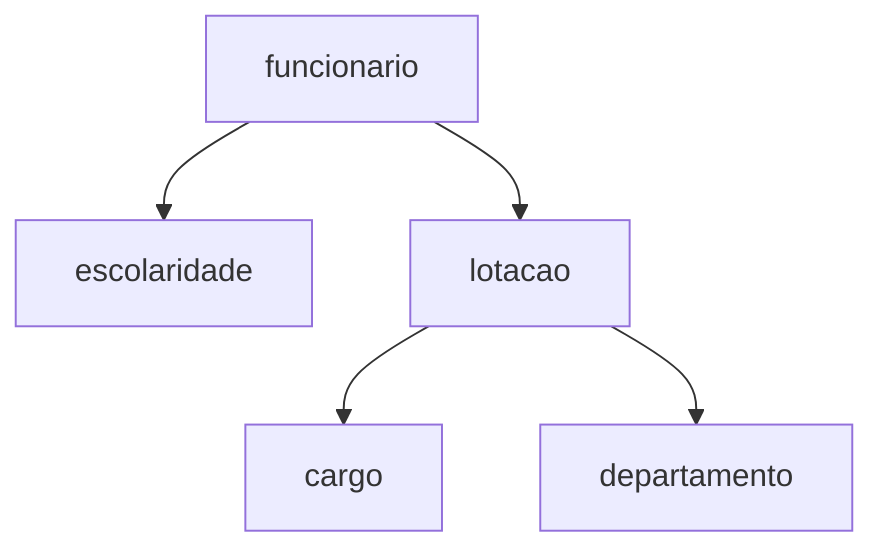

---

# 🛒 Schema `vendas`

O schema `vendas` concentra as informações comerciais.

### Tabelas

```text
vendas
├── categoria
├── forma_pagamento
├── item_nota_fiscal
├── nota_fiscal
├── parcela
└── produto
```

### Estrutura conceitual

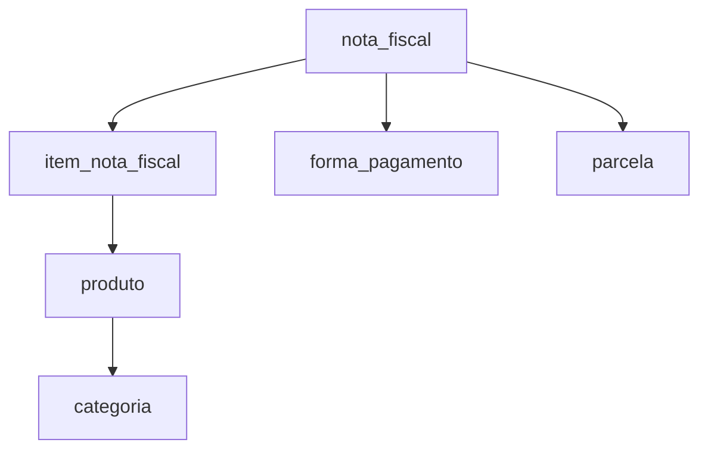

---

# 🔗 Relacionamento dos Dados

Uma das principais etapas do projeto é integrar dados de diferentes tabelas.

## Vendas + Clientes

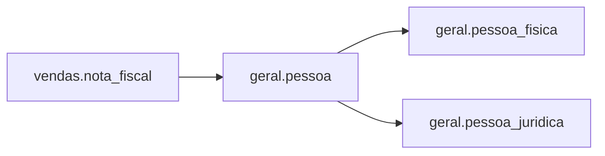

---

## Vendas + Produtos

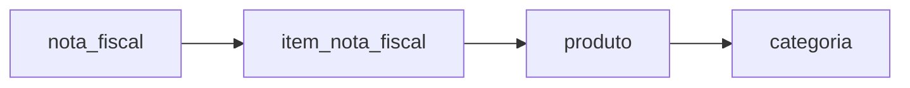

---

## Vendas + Vendedores + RH

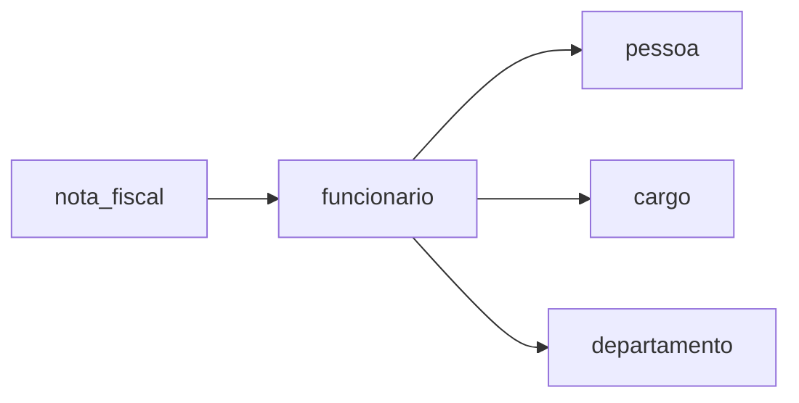

Essa integração permite transformar um `id_vendedor` em informações de negócio, como nome, cargo e departamento.

---

# 🔄 Pipeline de Dados

O pipeline segue as etapas:

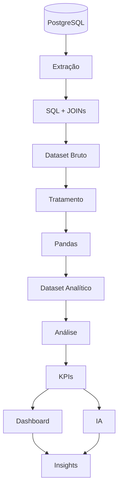

---

# 🔎 Extração dos Dados

A extração é realizada utilizando **SQLAlchemy** e consultas SQL.

O módulo responsável por essa etapa é:

```text
src/extraction.py
```

Durante o desenvolvimento foram realizadas consultas para:

- Identificação dos schemas;
- Identificação das tabelas;
- Identificação das colunas;
- Exploração dos dados;
- Testes de relacionamento;
- Extração de vendas;
- Identificação dos clientes;
- Identificação dos vendedores.

---

# 📚 Dicionário de Dados

A exploração do banco permitiu identificar as estruturas existentes.

## Financeiro

| Tabela | Finalidade |
|---|---|
| `conta_pagar` | Contas a pagar |
| `conta_receber` | Contas a receber |
| `situacao_titulo` | Situação dos títulos |

## Geral

| Tabela | Finalidade |
|---|---|
| `pessoa` | Cadastro base de pessoas |
| `pessoa_fisica` | Dados de pessoas físicas |
| `pessoa_juridica` | Dados de pessoas jurídicas |
| `endereco` | Endereços |
| `bairro` | Bairros |
| `cidade` | Cidades |
| `estado` | Estados |
| `contato` | Contatos |
| `tipo_contato` | Tipos de contato |

## RH

| Tabela | Finalidade |
|---|---|
| `funcionario` | Funcionários |
| `cargo` | Cargos |
| `departamento` | Departamentos |
| `escolaridade` | Escolaridade |
| `lotacao` | Lotação dos funcionários |

## Vendas

| Tabela | Finalidade |
|---|---|
| `nota_fiscal` | Notas fiscais |
| `item_nota_fiscal` | Itens vendidos |
| `produto` | Produtos |
| `categoria` | Categorias |
| `forma_pagamento` | Formas de pagamento |
| `parcela` | Parcelas |

---

# 🧹 Transformação dos Dados

Após a extração, os dados passam pela etapa de transformação.

O módulo responsável é:

```text
src/transformation.py
```

## Principais tratamentos

### Tipos de dados

Conversão de campos para tipos adequados:

```text
Datas
Valores numéricos
Inteiros
Strings
Booleanos
```

### Valores ausentes

Identificação e tratamento de valores nulos quando necessário.

### Padronização

Padronização de nomes, formatos e estruturas para facilitar as análises.

### Colunas derivadas

Criação de informações adicionais a partir dos dados existentes.

---

# 📊 Análise dos Dados

O módulo:

```text
src/analysis.py
```

concentra a camada analítica do projeto.

A análise busca transformar os dados tratados em indicadores de negócio.

Exemplos:

- Faturamento;
- Quantidade de vendas;
- Ticket médio;
- Ranking de vendedores;
- Ranking de clientes;
- Desempenho por produto;
- Desempenho por categoria;
- Indicadores financeiros.

---

# 📈 Indicadores

## 🛒 Vendas

Principais indicadores:

| Indicador | Descrição |
|---|---|
| 💰 Faturamento | Valor total das vendas |
| 🧾 Quantidade de vendas | Número de vendas realizadas |
| 🎯 Ticket médio | Valor médio das vendas |
| 👨‍💼 Ranking | Desempenho dos vendedores |
| 📦 Produtos | Desempenho por produto |
| 🏷️ Categorias | Desempenho por categoria |

---

# 👥 Perfil dos Clientes

Durante a exploração inicial da base foram identificadas:

| Perfil | Quantidade |
|---|---:|
| 👥 Total de pessoas | **15.962** |
| 👤 Pessoas físicas | **14.155** |
| 🏢 Pessoas jurídicas | **1.807** |

Essa informação permite realizar análises de segmentação dos clientes.

---

# 👨‍💼 Vendedores

Durante a exploração da tabela `vendas.nota_fiscal`, foram identificados IDs de vendedores.

Exemplo:

```text
id_vendedor
-----------
728
3127
4614
4907
5778
6321
7269
7479
9520
10448
...
```

Esses identificadores podem ser relacionados à estrutura de RH para obter informações complementares.

Fluxo:

```text
nota_fiscal
     ↓
id_vendedor
     ↓
funcionario
     ↓
pessoa
     ↓
nome
```

Também é possível relacionar:

```text
funcionario
     ↓
lotacao
     ↓
cargo
     ↓
departamento
```

---

# 💰 Análise Financeira

As informações financeiras permitem analisar:

- Contas a pagar;
- Contas a receber;
- Valores originais;
- Valores atuais;
- Vencimentos;
- Pagamentos;
- Recebimentos;
- Situação dos títulos;
- Formas de pagamento.

Exemplo de fluxo:

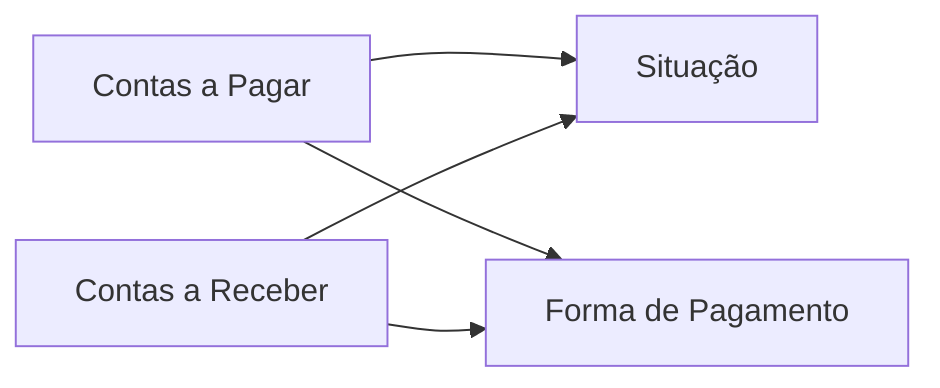

---

# 📦 Análise de Produtos

Os produtos são relacionados às categorias e aos itens das notas fiscais.

```text
Produto
   ↓
Categoria
   ↓
Item da Nota
   ↓
Nota Fiscal
   ↓
Cliente
   ↓
Vendedor
```

Com isso é possível analisar:

- Produtos mais vendidos;
- Produtos com maior faturamento;
- Categorias com maior desempenho;
- Quantidade vendida;
- Valor de venda;
- Valor de custo;
- Margem.

---

# 📊 Dashboard

A camada de apresentação utiliza **Streamlit**.

O objetivo é disponibilizar os indicadores de maneira interativa.

## Estrutura conceitual

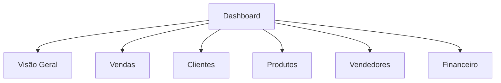

---

# 📈 Visualizações

As visualizações são desenvolvidas utilizando **Plotly**.

Entre as possibilidades de análise:

- Gráficos de evolução;
- Ranking;
- Distribuição;
- Comparações;
- Indicadores;
- Filtros;
- Segmentações.

A intenção é utilizar a visualização como ferramenta de apoio à interpretação dos dados.

---

# 🤖 Inteligência Artificial

O projeto possui uma camada específica para integração com Inteligência Artificial:

```text
src/ai_analysis.py
```

Essa camada recebe indicadores ou informações analíticas e utiliza uma API de IA para auxiliar na interpretação.

## Fluxo

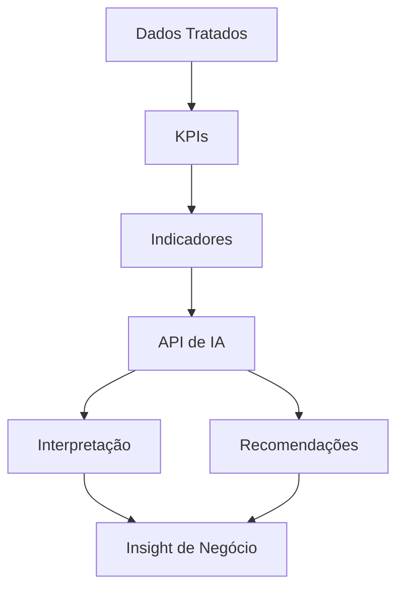

## Objetivo

A IA não substitui os cálculos realizados pelo pipeline.

Ela atua como uma camada complementar para:

- Interpretar indicadores;
- Identificar pontos de atenção;
- Gerar recomendações;
- Apoiar a análise de negócio.

---

# 🔐 Segurança

O projeto utiliza variáveis de ambiente para evitar que informações sensíveis sejam inseridas diretamente no código.

## Exemplo

```env
DB_HOST=seu_host
DB_PORT=5432
DB_NAME=seu_database
DB_USER=seu_usuario
DB_PASSWORD=sua_senha

GROQ_API_KEY=sua_chave
```

## Arquivos sensíveis

O arquivo:

```text
.env
```

não deve ser enviado para o GitHub.

O `.gitignore` deve conter:

```text
.env
venv/
__pycache__/
*.pyc
```

## ⚠️ Importante

Nunca publique:

- Senhas;
- API Keys;
- Tokens;
- Credenciais;
- Dados privados;
- Arquivos de configuração sensíveis.

---

# 📁 Estrutura do Projeto

```text
digital-corporativo-data-analytics/
│
├── 📄 app.py
├── 📄 README.md
├── 📄 requirements.txt
├── 📄 .gitignore
├── 📄 .env
│
├── 📁 src/
│   ├── 📄 __init__.py
│   ├── 📄 database.py
│   ├── 📄 extraction.py
│   ├── 📄 transformation.py
│   ├── 📄 analysis.py
│   └── 📄 ai_analysis.py
│
└── 📁 docs/
    └── 📄 documentação-projeto.pdf
```

---

# 🧩 Descrição dos Arquivos

## `app.py`

Arquivo principal da aplicação.

Responsável por iniciar o dashboard Streamlit e apresentar os resultados para o usuário.

---

## `src/database.py`

Responsável pela conexão com PostgreSQL.

Tecnologias utilizadas:

- SQLAlchemy;
- PostgreSQL;
- python-dotenv.

Fluxo:

```text
Python
  ↓
SQLAlchemy
  ↓
PostgreSQL
```

---

## `src/extraction.py`

Responsável pela extração e exploração dos dados.

Principais responsabilidades:

- Consultas SQL;
- Identificação de schemas;
- Identificação de tabelas;
- Identificação de colunas;
- JOINs;
- Extração dos datasets.

---

## `src/transformation.py`

Responsável pela transformação dos dados.

Principais responsabilidades:

- Limpeza;
- Padronização;
- Conversão de tipos;
- Tratamento de valores nulos;
- Criação de colunas;
- Preparação do dataset analítico.

---

## `src/analysis.py`

Responsável pela análise.

Principais responsabilidades:

- KPIs;
- Métricas;
- Rankings;
- Indicadores;
- Regras de negócio.

---

## `src/ai_analysis.py`

Responsável pela integração com Inteligência Artificial.

Principais responsabilidades:

- Envio dos indicadores para a API;
- Processamento da resposta;
- Geração de insights;
- Recomendações.

---

## `requirements.txt`

Arquivo responsável por listar as dependências Python necessárias para executar o projeto.

Exemplo:

```text
pandas
numpy
sqlalchemy
psycopg2
streamlit
plotly
python-dotenv
```

---

## `.gitignore`

Responsável por impedir que arquivos desnecessários ou sensíveis sejam enviados ao GitHub.

Exemplo:

```text
venv/
.env
__pycache__/
*.pyc
```

---

# ⚙️ Instalação

## 1. Clonar o repositório

```bash
git clone https://github.com/SamuelFreitasSouza/digital-corporativo-data-analytics.git
```

## 2. Entrar no projeto

```bash
cd digital-corporativo-data-analytics
```

## 3. Criar ambiente virtual

```bash
python -m venv venv
```

## 4. Ativar ambiente virtual

### Windows PowerShell

```powershell
.\venv\Scripts\Activate.ps1
```

## 5. Instalar dependências

```bash
python -m pip install -r requirements.txt
```

---

# 🔧 Configuração

Crie o arquivo:

```text
.env
```

Configure as variáveis necessárias.

Exemplo:

```env
DB_HOST=seu_host
DB_PORT=5432
DB_NAME=seu_database
DB_USER=seu_usuario
DB_PASSWORD=sua_senha
```

Caso utilize a integração com IA:

```env
GROQ_API_KEY=sua_chave
```

---

# 🧪 Testando a Conexão

Execute:

```bash
python src/database.py
```

Resultado esperado:

```text
Conexão realizada com sucesso!

(1,)
```

---

# 🔎 Testando a Extração

Execute:

```bash
python src/extraction.py
```

O script realiza consultas para exploração e extração dos dados.

---

# ▶️ Executando o Dashboard

Com o ambiente virtual ativado:

```bash
python -m streamlit run app.py
```

O Streamlit iniciará o dashboard localmente.

---

# 🧪 Validação do Projeto

A sequência recomendada para validação é:

```text
1. database.py
       ↓
2. extraction.py
       ↓
3. transformation.py
       ↓
4. analysis.py
       ↓
5. app.py
```

## Etapa 1 — Banco

Verificar se a conexão está funcionando.

## Etapa 2 — Extração

Verificar se os dados estão sendo retornados.

## Etapa 3 — Transformação

Verificar tipos, nulos e estrutura dos datasets.

## Etapa 4 — Análise

Verificar os indicadores.

## Etapa 5 — Dashboard

Verificar os gráficos e filtros.

---

# 🗺️ Roadmap

## ✅ Concluído

- [x] Configuração do ambiente Python
- [x] Criação do ambiente virtual
- [x] Conexão com PostgreSQL
- [x] Exploração dos schemas
- [x] Identificação das tabelas
- [x] Dicionário de dados
- [x] Teste de conexão
- [x] Teste de extração
- [x] Análise inicial de vendas
- [x] Análise inicial de clientes
- [x] Identificação dos vendedores
- [x] Estruturação dos módulos
- [x] Estrutura inicial do dashboard
- [x] Integração inicial com IA
- [x] Configuração do Git
- [x] Publicação no GitHub

## 🔄 Em desenvolvimento

- [ ] Refinamento dos JOINs
- [ ] Tratamento completo dos datasets
- [ ] Padronização dos indicadores
- [ ] Consolidação dos KPIs
- [ ] Refinamento visual do dashboard
- [ ] Validação das recomendações da IA
- [ ] Melhorias de UX/UI

## 🚀 Próximos passos

- [ ] Deploy do dashboard
- [ ] Automação do pipeline
- [ ] Atualização automática dos dados
- [ ] Testes automatizados
- [ ] Monitoramento
- [ ] Documentação das métricas
- [ ] Evolução da camada de IA

---

# 🎓 Competências Demonstradas

Este projeto demonstra conhecimentos práticos em:

## 🐍 Python

- Desenvolvimento modular;
- Funções;
- Imports;
- Ambiente virtual;
- Tratamento de erros;
- Variáveis de ambiente;
- Integração com APIs.

## 🗄️ SQL

- SELECT;
- JOIN;
- WHERE;
- GROUP BY;
- ORDER BY;
- Consultas analíticas;
- Exploração de banco.

## 🐘 PostgreSQL

- Schemas;
- Tabelas;
- Relacionamentos;
- Tipos de dados;
- Estrutura relacional.

## 🔄 ETL

```text
Extract
   ↓
Transform
   ↓
Analyze
```

## 📊 Data Analytics

- Análise exploratória;
- KPIs;
- Métricas;
- Rankings;
- Segmentação;
- Análise temporal;
- Análise comercial;
- Análise financeira.

## 📈 Business Intelligence

- Dashboards;
- Indicadores;
- Storytelling;
- Visualização;
- Apoio à decisão.

## 🤖 Inteligência Artificial

- Integração com API;
- Interpretação de indicadores;
- Geração de insights;
- Recomendações.

## 🛠️ Dev Tools

- VS Code;
- Git;
- GitHub;
- Ambiente virtual;
- `.env`.

---

# 🧠 Principais Aprendizados

O desenvolvimento deste projeto permitiu trabalhar com um fluxo completo de dados:

```text
BANCO DE DADOS
      ↓
EXPLORAÇÃO
      ↓
SQL
      ↓
JOINs
      ↓
EXTRAÇÃO
      ↓
TRATAMENTO
      ↓
PANDAS
      ↓
ANÁLISE
      ↓
KPIs
      ↓
VISUALIZAÇÃO
      ↓
DASHBOARD
      ↓
INTELIGÊNCIA ARTIFICIAL
      ↓
INSIGHTS
```

O principal aprendizado é compreender que um projeto de dados não começa no gráfico.

Ele começa no entendimento do dado.

```text
DADO
 ↓
CONTEXTO
 ↓
TRATAMENTO
 ↓
ANÁLISE
 ↓
INFORMAÇÃO
 ↓
DECISÃO
```

---

# 📚 Documentação

A documentação técnica completa do projeto está disponível na pasta:

```text
docs/
└── documentação-projeto.pdf
```

A documentação apresenta informações sobre:

- Arquitetura;
- Banco de dados;
- Schemas;
- Extração;
- Transformação;
- Análise;
- Dashboard;
- Inteligência Artificial;
- Segurança;
- Execução.

---

# 🌟 Diferenciais do Projeto

O projeto busca demonstrar uma visão mais completa do ciclo de dados.

### Não é apenas:

```text
Python + Gráfico
```

### É:

```text
PostgreSQL
    +
SQL
    +
JOINs
    +
ETL
    +
Pandas
    +
Análise
    +
KPIs
    +
Dashboard
    +
IA
```

Isso permite demonstrar conhecimentos que podem ser aplicados em projetos reais de **Data Analytics e Business Intelligence**.

---

# 📌 Fluxo Completo do Projeto

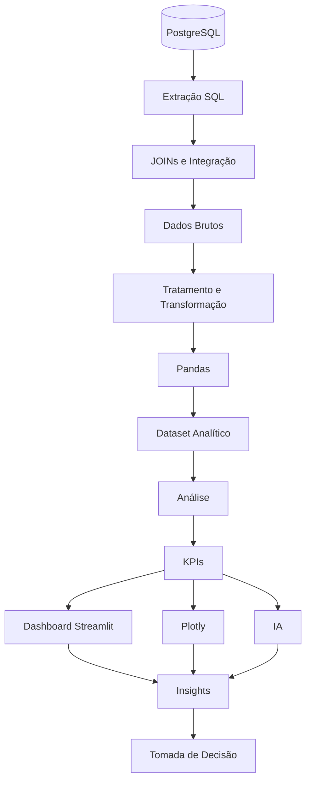

---

# 👨‍💻 Autor

## Samuel Freitas Souza

**Data Analyst | BI Specialist | SQL & Power BI**

Profissional em desenvolvimento na área de dados, com foco em:

- Data Analytics;
- Business Intelligence;
- SQL;
- Python;
- Power BI;
- Visualização de Dados;
- Inteligência Artificial.

### GitHub

[](https://github.com/SamuelFreitasSouza)

### LinkedIn

[](https://www.linkedin.com/in/samuel-freitas-944288180/)

---

# ⭐ Considerações Finais

Este projeto representa a aplicação prática de conceitos de **Data Analytics**, conectando banco de dados, programação, ETL, análise, visualização e Inteligência Artificial.

O objetivo final é transformar:

> **Dados → Informação → Insight → Decisão**

---

<div align="center">

### 📊 Digital Corporativo — Data Analytics

**Python • SQL • PostgreSQL • Pandas • Plotly • Streamlit • IA**

⭐ **Se este projeto foi útil ou interessante, considere deixar uma estrela no repositório.**

</div>